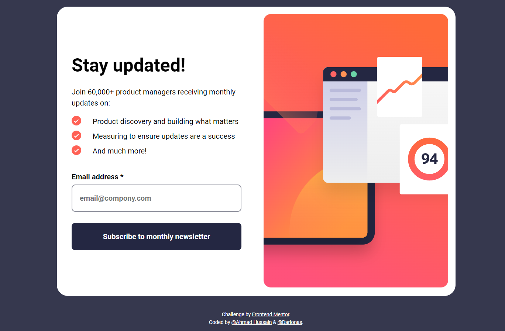

# Frontend Mentor - Newsletter sign-up form with success message solution

This is a solution to the [Newsletter sign-up form with success message challenge on Frontend Mentor](https://www.frontendmentor.io/challenges/newsletter-signup-form-with-success-message-3FC1AZbNrv). 

## Table of contents

- [Overview](#overview)
  - [The challenge](#the-challenge)
  - [Screenshot](#screenshot)
  - [Links](#links)
- [My process](#my-process)
  - [Built with](#built-with)
  - [What I learned](#what-i-learned)
  - [Continued development](#continued-development)
  - [Useful resources](#useful-resources)
- [Author](#author)
- [Acknowledgments](#acknowledgments)

## Overview

### The challenge

Users should be able to:

- Add their email and submit the form
- See a success message with their email after successfully submitting the form
- See form validation messages if:
  - The field is left empty
  - The email address is not formatted correctly
- View the optimal layout for the interface depending on their device's screen size
- See hover and focus states for all interactive elements on the page

### Screenshot

### Links

- Solution URL: (https://github.com/Darionas/newsletter-sign-up-form-with-success-message)
- Live Site URL: (https://darionas.github.io/newsletter-sign-up-form-with-success-message/)

## My process

### Built with

Collab project was created by **Ahmad Hussain** and **darionas** from Frontend Mentor.

* Create drawing from design (structure of design)
 * Create of repo
 * Create HTML layout
 * Create CSS layout according style guides
 * Create CSS layout for mobile first
 * Craete CSS layout for desktop
 * Implement JavaScript

Used techniques:

  * BEM;
  * Accessibility

But created with :heart:

### What I learned

Hey, we practiced collab on GitHub platform. For RWD we used grid layout, media query. We adupt BEM and Accessibility techniques. And we succeded. Thank you **Ahmad Hussain** for collab.

I learned to execute JavaScript after form reset.

### Continued development

Continue collab on GitHub platform.

### Useful resources

- [After form reset initiate javascript flow](https://stackoverflow.com/questions/10319289/how-to-execute-code-after-html-form-reset-with-jquery/27949904#27949904) - This helped me execute JavaScript flow after form reset (submition). 

## Author

- Discord of Frontend Mentor - Ahmad Hussain
- Discord of Frontend Mentor - Darionas

## Acknowledgments

- Thank you Frontend Mentor team for opportunity to try, practice, train yourself in different level challenges and gain invaluable experience.
